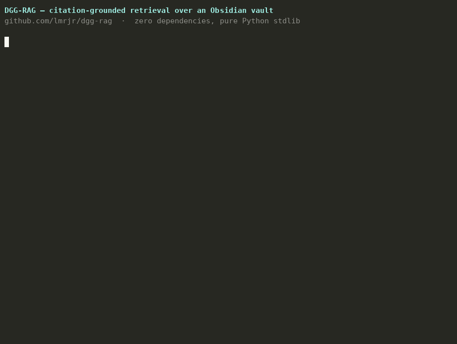

# DGG-RAG — a citation-grounded retrieval engine for the Obsidian vault

A working proof-of-concept, built by **Luis M. Rangel Jr.** for Destiny's research operation.
It answers the problem from the trust/magnitude video directly: when a claim carries the wrong
**magnitude**, you want the *exact source and figure from your own vetted notes* in one query —
not a third party's summary you have to take on faith.

> "The only way society works is if you trust other people… but who do you trust? For me it's
> almost nobody." — the fix isn't zero trust, it's **checkable** trust: every answer comes back
> with its receipt attached.

## ▶ Demo



A 20-second terminal walk-through: index a vault, then ask two questions — each answer comes back
with its **sources attached**. Replay the raw recording with
`asciinema play demo/destiny-demo.cast` (regenerate the GIF with
`agg demo/destiny-demo.cast demo/destiny-demo.gif`).

## What it does
- Ingests an **Obsidian markdown vault** exactly as it sits on disk (frontmatter, `[[wikilinks]]`,
  headings — all handled).
- Chunks each note by heading/paragraph, keeps the **note title + file path**, and **extracts the
  citations** (URLs + APA-style references) so every hit returns the sources, not just prose.
- Retrieves with **BM25** by default — fast, transparent, and **zero third-party dependencies**
  (pure Python 3 stdlib; runs anywhere, no model download, nothing to trust that you can't read).
- Optional **semantic** backend using a **local Ollama** embedding model — the same self-hosted
  stack I already run in production in my homelab (where a version of this indexes 1,500+ chunks
  into a real vector DB). Nothing leaves your machine.

## Run it (30 seconds, no install)
```bash
python3 dgg_rag.py index --vault sample_vault
python3 dgg_rag.py query "heavy metals in food how big is the risk" -k 2
python3 dgg_rag.py query "can you trust experts and institutions" -k 1
```
Example output — note the **receipt** on every hit:
```
[1] RFK - heavy metals in food  ›  RFK Jr. — "heavy metals in our food"   (score 6.649)
    file: sample_vault/RFK - heavy metals in food.md
    ...the implied magnitude ("our food is poisoning kids") is unsupported...
    citations (from this note):
      • https://www.fda.gov/food/.../closer-zero-...
      • https://www.fda.gov/food/science-research-food/total-diet-study
```

## Point it at the REAL vault
The bundled `sample_vault/` is four illustrative notes so the demo runs out of the box. To run it
on the actual research vault, export the Obsidian vault to a folder of `.md` files and:
```bash
python3 dgg_rag.py index --vault /path/to/destiny-vault
python3 dgg_rag.py query "your question" -k 5
```
Because it reads plain Obsidian markdown, **it works on the live vault unchanged.**

## Semantic backend (matches my production homelab stack)
```bash
python3 dgg_rag.py index --vault sample_vault --backend ollama --host http://localhost:11434
python3 dgg_rag.py query "who do you trust" --backend ollama
```
Uses `nomic-embed-text` via a local Ollama server. Same idea as my homelab RAG that reindexes a
1,578-chunk markdown corpus and is queried by an agent.

## Where this goes in production (the actual offer)
This POC is the retrieval core. The full system I'd build for the desk:
1. **Live index** of the vault that reindexes on save (so mid-stream notes are searchable instantly).
2. **A hotkey / chat box** that returns the top passages **with citations** during a debate.
3. **Answer synthesis** — an LLM that drafts the rebuttal *grounded only in retrieved, cited
   passages* (no ungrounded claims; every sentence traceable to a source).
4. **A statistician in the loop** (me) — the person who checks whether a cited figure is a count vs.
   a modeled estimate, whether the magnitude holds, and whether "the data was collected correctly."
5. **Self-hosted / private** — nothing leaves infrastructure you control.

## Files
- `dgg_rag.py` — the engine (ingest · chunk · BM25 · optional Ollama · query). ~230 lines, stdlib only.
- `sample_vault/` — four illustrative notes with real, checkable citations.

*Sample-vault claims are illustrative and sourced to real public bodies (FDA, Pew, peer-reviewed
journals); they exist to demonstrate retrieval, not to stand in for the real vault's content.*
